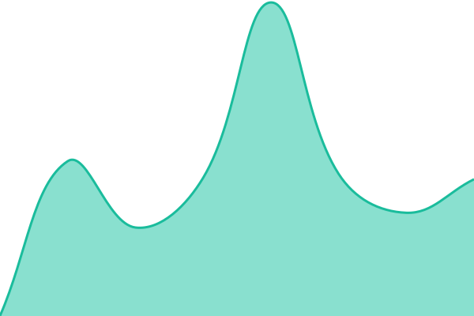

# [📈 Live Status](https://upptime.octav.name): <!--live status--> **🟩 All systems operational**

This repository contains the open-source uptime monitor and status page for [Octav](https://www.linkedin.com/in/octavianmatei/), powered by [Upptime](https://github.com/upptime/upptime).

With [Upptime](https://upptime.js.org), you can get your own unlimited and free uptime monitor and status page, powered entirely by a GitHub repository. We use [Issues](https://github.com/tavy315/uptime/issues) as incident reports, [Actions](https://github.com/tavy315/uptime/actions) as uptime monitors, and [Pages](https://upptime.octav.name) for the status page.

<!--start: status pages-->
<!-- This summary is generated by Upptime (https://github.com/upptime/upptime) -->
<!-- Do not edit this manually, your changes will be overwritten -->
<!-- prettier-ignore -->
| URL | Status | History | Response Time | Uptime |
| --- | ------ | ------- | ------------- | ------ |
|  [Octav.Name](https://www.octav.name) | 🟩 Up | [octav-name.yml](https://github.com/tavy315/uptime/commits/HEAD/history/octav-name.yml) | 

 161ms
     
 | 

<a href="https://upptime.octav.name/history/octav-name">100.00%</a>
    

|  [LG-Imports](https://www.lg-imports.be) | 🟩 Up | [lg-imports.yml](https://github.com/tavy315/uptime/commits/HEAD/history/lg-imports.yml) | 

 872ms
     
 | 

<a href="https://upptime.octav.name/history/lg-imports">100.00%</a>
    

|  [Taxandrian](https://www.taxandrian.com) | 🟩 Up | [taxandrian.yml](https://github.com/tavy315/uptime/commits/HEAD/history/taxandrian.yml) | 

 769ms
     
 | 

<a href="https://upptime.octav.name/history/taxandrian">100.00%</a>
    

<!--end: status pages-->

[**Visit our status website →**](https://upptime.octav.name)

## 📄 License

- Powered by: [Upptime](https://github.com/upptime/upptime)
- Code: [MIT](./LICENSE) © [Octav](https://www.linkedin.com/in/octavianmatei/)
- Data in the `./history` directory: [Open Database License](https://opendatacommons.org/licenses/odbl/1-0/)
